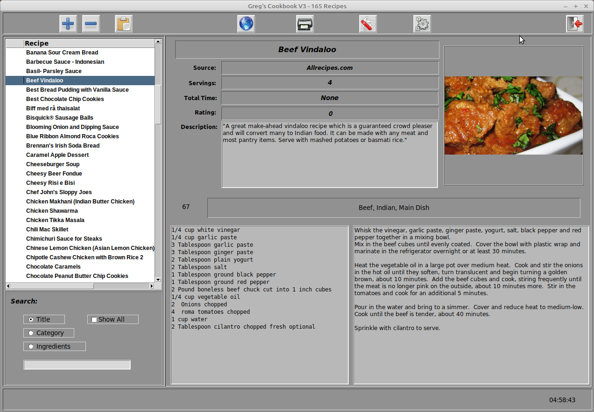

# CookbookV3
# GUI Cookbook program written in Python and Tk

This project is to act as a repository for my cookbook project.  It is written using Python 3.7.4 and tkinter.  The GUI designer is Page written by Don Rozenberg.  Page is Free Open Source software.  The website for Page is [https://sourceforge.net/projects/page/](https://sourceforge.net/projects/page/)

My cookbook program started out in the early 2000's as a recipe database for Android tablets written in B4A.  Version 2 was simply a re-write under Python using Page generated GUIs.  This is version 3 and is still in early development.

Python version 3.7x must be used for this project.

### NOTICE: I have made major changes to the code on 31 January, 2020.  Please make a copy of your recipe database and recipeimages folder.  I am currently working on a migration tool that will allow you to import any recipes that you might have added.  You will likely run into a bug or two hundred.  Please let me know if you find any issues.

## Screenshots (new ones will be uploaded soon)...

The main screen


The scraper screen


The editor/entry screen

**coming soon**

More images will become available as development continues.

## Required libraries
At the moment, there are three libraries that will need to be installed before you attempt to run the program(s).  They are:

* Pillow
* requests
* recipe_scrapers
* tkcolorpicker


All of these libraries can be installed using the Python pip installer.  As an example, to install the requests library, for Python 2.x you would use:
```bash
$ pip install requests
```
or
```bash
pip3 install requests
```
if you are using Python 3.x (which at this time you _*SHOULD*_ be using anyway).

## Sourcecode considerations

I can, without fear of contradiction, state that my coding style is very old school and more verbose that it "needs" to be.  Basically, I feel that I am a teacher, since I share my source code freely with anyone.  Therefore, I write as if anyone who reads my code is using it for learning purposes.  So I tend to keep the cryptic programming at a level of almost non-existance.  If you feel you don't like my coding style, that's alright.  Others seem to, so you must be in the minority. ;o}

I should put a quick note here about the number of files that make up my program.  When Page generates a GUI, there are three files that are created.  Assuming that your project is named "Project", it would create the following three files:

* Project.tcl (The Page .tcl file)
* Project.py  (What I call the GUI file)
* Project_support.py (where all the modifiable code is placed.)

It is _*NEVER*_ a good idea to modify either of the first two files by hand.  If you do so, there is a very good chance that your program will crash and you will be left with an unusable set of source code.  This is how Page works, and I like it.  When you want to see actual Python source code in any of my projects that use Page, the first place to look at is the *_support.py file.  Earlier, I alluded to the fact that my code is verbose and it's true.  Another habit of mine is that I comment the heck out of my code.  Again, it's because other people learn from my code, I write articles where I teach people about Python programming, and I'm old and have a hard time remembering what I was thinking when I wrote that code.  If you fork or clone or otherwise copy my code, that's fine.  Once it's on your machine, you can remove the comments if you feel moved to do so.

_*One final thing.  The .tcl files that Page creates are not compatible with any current versions of Page.  The project was designed with Page 5b, which as of 31 January 2020, is still in development.  Any previous version of Page will refuse to open these files.*_

## Acknowledgments

This project would not be possible if it weren't for the efforts of many other people, who have kindly and freely provided their source code.

*  Don Rozenberg - Author of __Page__, the GUI designer for Python - https://sourceforge.net/projects/page/
*  The authors and contributers of __recipe_scrapers__ - https://github.com/hhursev/recipe-scrapers
*  All maintainers of __Python__ - https://python.org

### About the author

My name is _*Greg Walters*_.  I have been involved with computers and computer programming since 1972.
I am well versed in Visual Basic, Visual Basic .NET, Python, and SQL, and is an
accomplished user of MySQL, SQLite, Microsoft SQL Server, Oracle, C++, Delphi,
Modula-2, Pascal, C, 80x86 Assembler, COBOL, and Fortran. I have been a programming trainer and has trained numerous people on many pieces of computer software, including MySQL, Open Database Connectivity, Quattro Pro, Corel Draw!, Paradox, Microsoft Word, Excel, DOS, Windows 3.11, Windows for Workgroups, Windows 95, Windows NT, Windows
2000, Windows XP, and Linux. I am semi-retired and has written over 100 articles for the Full Circle magazine. I am open to working as a freelancer on various projects.  I also have authored one book solo, co-authored another and am currently acting as a freelance Technical Reviewer for *Packt Publishing* having done 7 books to date.

As you can tell, I have been around a long time.

Please note:  This readme file is a living document, as is the source code, and subject to being changed at any time.  Usually in the early mornings when I haven't had enought coffee.

Thank you for stopping by.  I hope you enjoy the code and the program.

*greg*