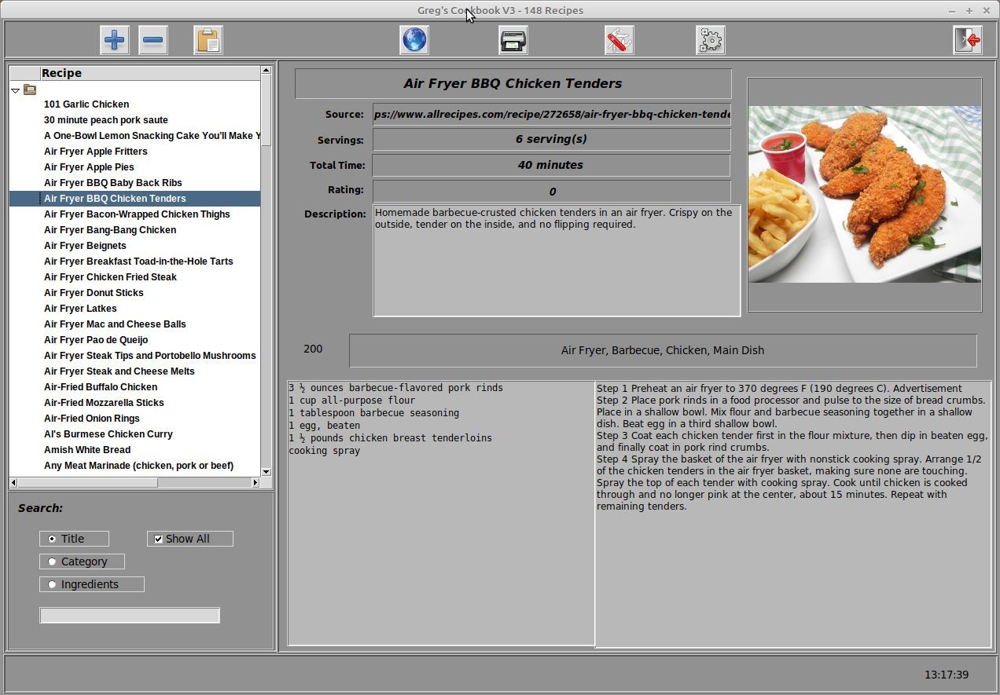
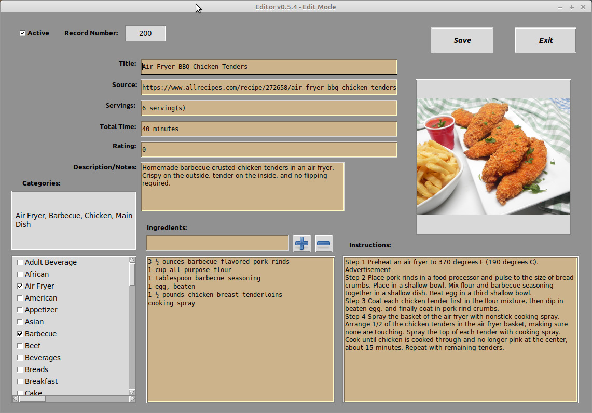
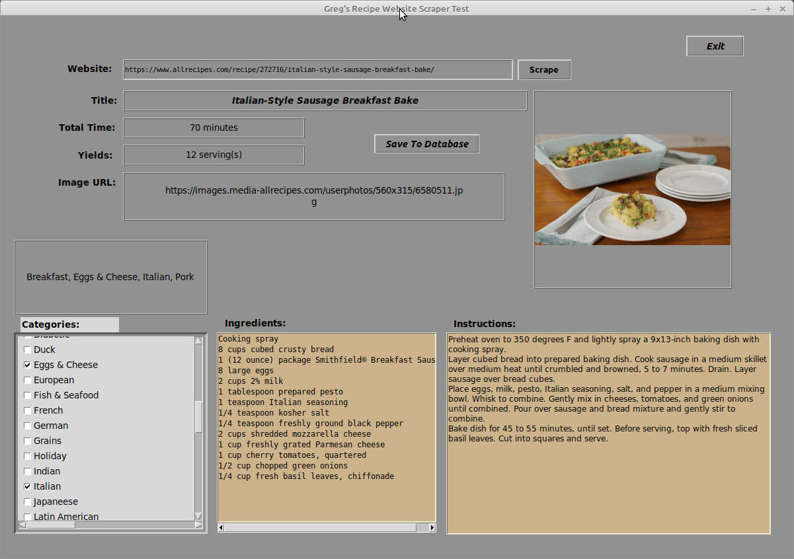
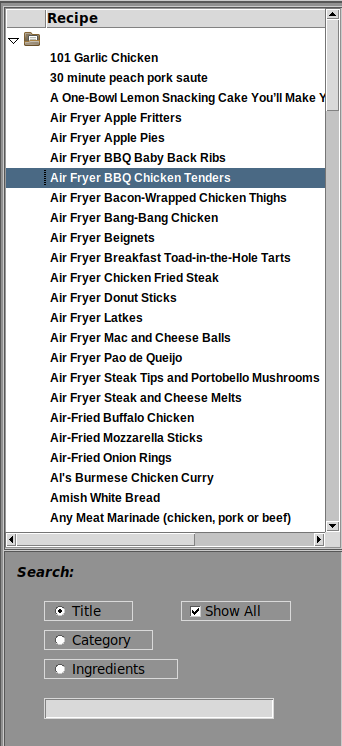
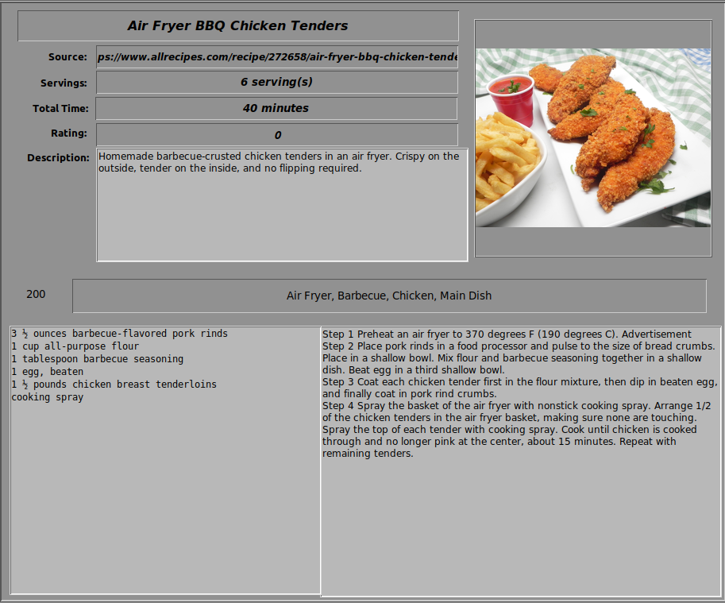

# Greg's Cookbook V3

## Overview

_**Greg's Cookbook Version 3**_ is a database driven cookbook management system.

It's features are:

* Graphical User Interface

* Recipe website scraper

* New recipe entry

* Edit screen

* Print a recipe

* Images for the recipes

* Over 60 preset categories

* Selectable themes for the screens (coming soon)

_**This document is currently under construction, so there might be some or many parts missing.  Please be patient.**_

## Requirements

* Python 3.7 or greater
* The following libraries must be installed:

  - requests
  - recipe_scrapers
  - Pillow
  - tkcolorpicker

All of the required libraries can be installed via Pip


## Screens

_**The screen shots are not yet complete...**_

### Main Screen


### New Recipe Screen


### Edit Recipe Screen



### Web Scraper Screen



### Database Utilities Screen


### Configuration Screen
The Configuration module is currently not implemented.  It is assumed that it will be available sometime before February 29, 2020.


## Using Greg's Cookbook

Within the distribution folder, you can start the program by typing:

```bash
$ ./cookbook3.py
```

From there, you will be presented with the main screen.


Along the top, is the tool bar.


From left to right, the buttons are:
* Add a new recipe
* Delete the current recipe
* Edit the current recipe
* Scrape a recipe web page
* Print the current recipe
* Database Utility
* Configuration Utility (coming soon)
* Exit the program

Along the left side of the form is the navigation bar



This portion of the screen will change based on the search options you select.

The rest of the screen is dedicated to the details of the recipe.



## The Recipe Scraper


## The Edit Screen


## The New Recipe Screen


_**Yet to be completed**_

## For curious programmers...

_**To be compleated soon...**_